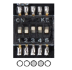
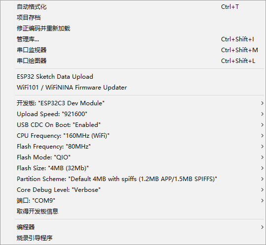
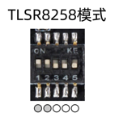
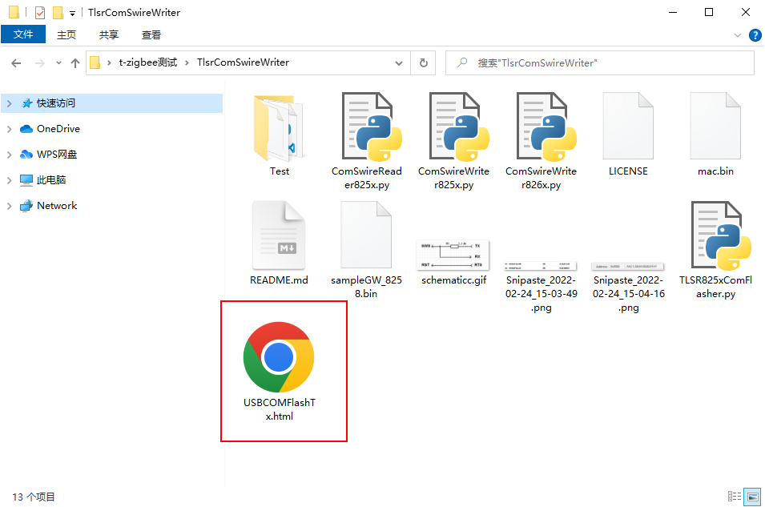
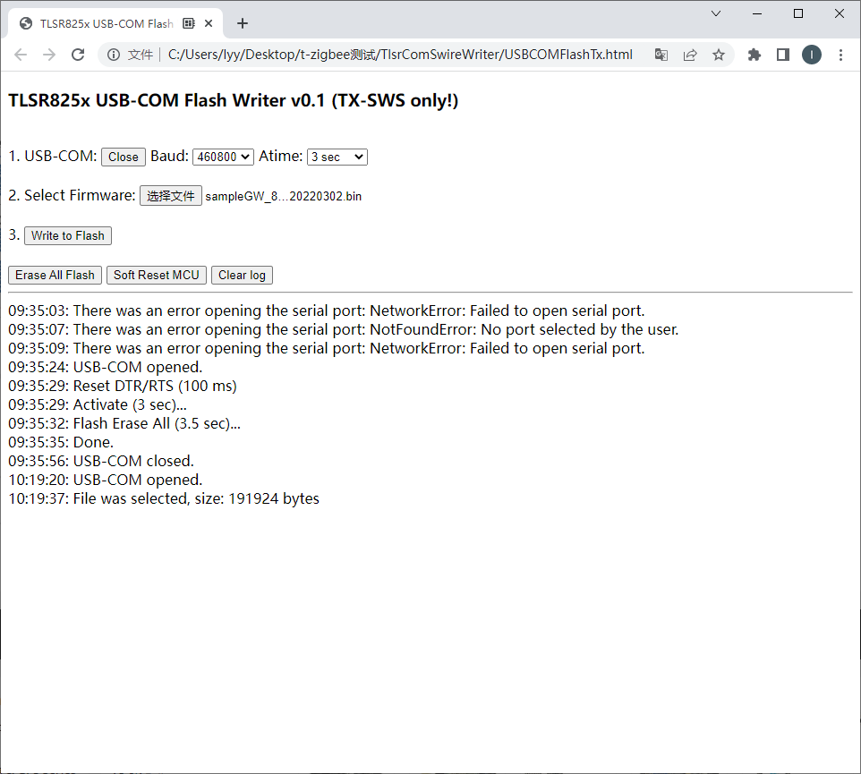

Burning Guide
==============

Introduction
-------------

:code:`T-ZigBee` has two onboard SOCs, :code:`ESP32-C3` of :code:`espressif` and
:code:`TLSR8258` of :code:`telink`.

Among them, :code:`ESP32-C3` integrates WiFI and BLE, and :code:`TLSR8258`
integrates ZigBee and BLE. :code:`TLSR8258` uses its ZigBee functionality only.

To program firmware for ESP32-C3 and TLSR8258, you need to use :code:`T-U2T`.
Through the DIP switch, choose to burn the firmware for different SOCs.

Although ESP32-C3 supports using USB to download firmware, in some development
environments, you cannot directly use USB to view debugging information,
which is inconvenient.Therefore, we use UART0 of ESP32-C3 to download and debug
the firmware.

.. note::

    Because the power supply of TLSR8258 is controlled by GPIO of :code:`ESP32-C3`,
    before programming :code:`TLSR8258`, please program `examples/factory_test <https://github.com/Xinyuan-LilyGO/T-ZigBee/tree/main/examples/factory_test>`_
    This program to power on :code:`TLSR8258`.

ESP32-C3
---------

1. connect :code:`T-U2T` connect to :code:`T-ZigBee`

.. image:: ../../_static/user-guide/burning/connect.jpg

2. Set the DIP switch

3. Burning

TLSR8258
---------

.. note::

    :code:`T-ZigBee` has been programmed with `sampleGW_8258_20220302.bin <https://github.com/Xinyuan-LilyGO/T-ZigBee/blob/main/firmware/sampleGW_8258_20220302.bin>`_,
    if not correct :code:` TLSR8258` makes other functional changes, it is not
    recommended to burn the firmware of :code:`TLSR8258` at will.

1. connect :code:`T-U2T` connect to :code:`T-ZigBee`

.. image:: ../../_static/user-guide/burning/connect.jpg

2. Set the DIP switch

3. Use :code:TlsrComSwireWriter` to burn firmware

Please download `TlsrComSwireWriter <https://github.com/pvvx/TlsrComSwireWriter>`_ in advance.

4. The burning is successful, the red indicator on the board will be on

.. image:: ../../_static/user-guide/burning/burning_successfully.jpg

Ordering Information
---------------------

========= ===================== ================ ================
Product   Order channel
========= ====================================== ================
T-ZigBee  t-zigbee_AliExpress_  t-zigbee_TaoBao_ t-zigbee_Amazon_
--------- --------------------- ---------------- ----------------
T-U2T     t-u2t_AliExpress_     t-u2t_TaoBao_    t-u2t_Amazon_
--------- --------------------- ---------------- ----------------
========= ===================== ================ ================

.. _t-zigbee_AliExpress: https://www.aliexpress.com/item/3256803996075052.html
.. _t-zigbee_TaoBao: https://item.taobao.com/item.htm?spm=a1z10.1-c-s.w4004-24322072003.14.59cd19e104w9za&id=673454311484
.. _t-zigbee_Amazon: https://www.amazon.com/dp/B0B4NWMSGR?ref=myi_title_dp&th=1
.. _t-u2t_AliExpress: https://www.aliexpress.com/item/3256802262618023.html
.. _t-u2t_TaoBao: https://item.taobao.com/item.htm?spm=a1z10.5-c-s.w4002-24322072023.27.26b01c38ExJUUl&id=641950617122
.. _t-u2t_Amazon: https://www.amazon.com/dp/B0B4NWJSDX?ref=myi_title_dp&th=1
