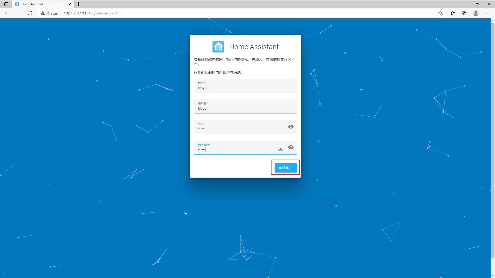
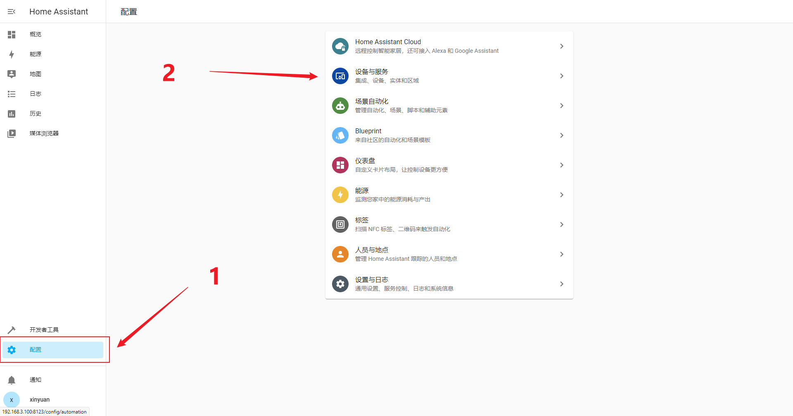
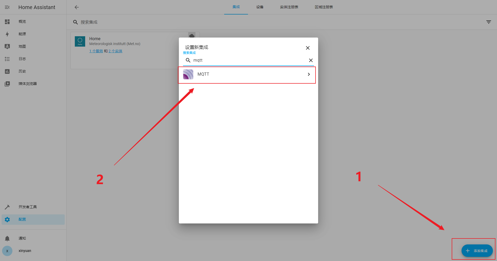
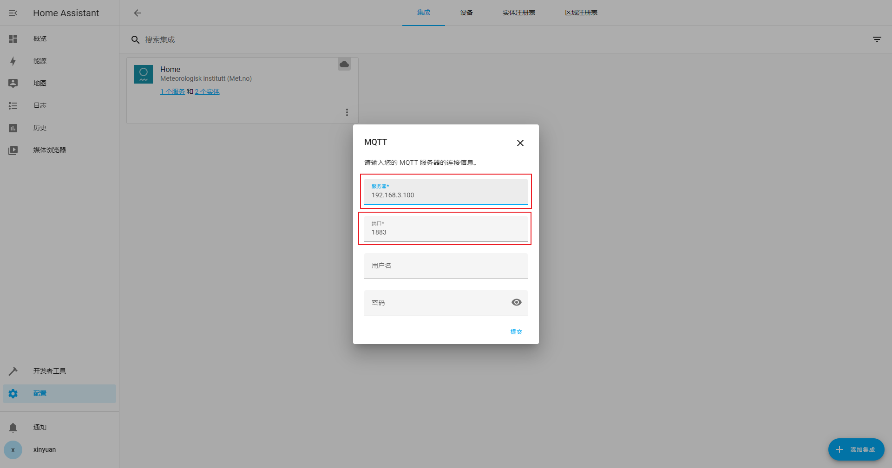
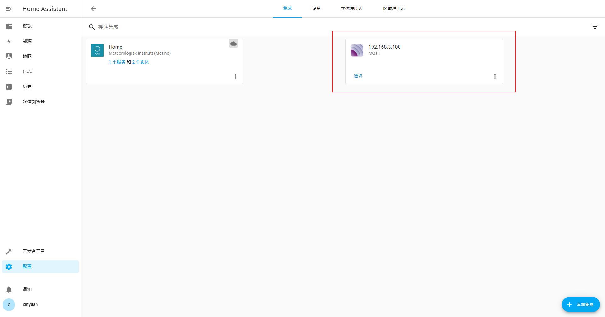

Home Assistant
==============

Install docker
--------------

.. code-block:: shell

    curl -fsSL https://get.docker.com | bash -s docker --mirror Aliyun

.. code-block:: shell

    $ pwd
    /home/pi
    $ mkdir homeassistant
    $ sudo docker run -d \
    --name homeassistant \
    --privileged \
    --restart=unless-stopped \
    -v /home/pi/homeassistant:/config \
    --network=host \
    ghcr.io/home-assistant/home-assistant:stable

For more information, please refer to https://www.home-assistant.io/installation/raspberrypi

Confirm
-------

.. code-block:: shell

    $ sudo docker ps -a
    CONTAINER ID   IMAGE                                          COMMAND   CREATED        STATUS        PORTS     NAMES
    f43aa176c789   ghcr.io/home-assistant/home-assistant:stable   "/init"   15 hours ago   Up 15 hours             homeassistant

Configuration
-------------

Once the Home Assistant Container is running Home Assistant should be accessible using :code:`http://<host>:8123` (replace with the hostname or IP of the system)

Integrated MQTT
---------------

