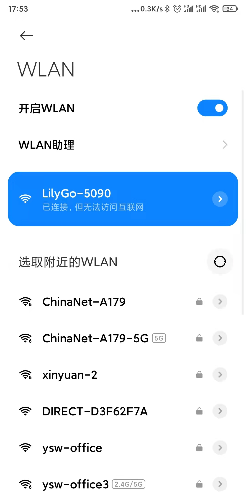
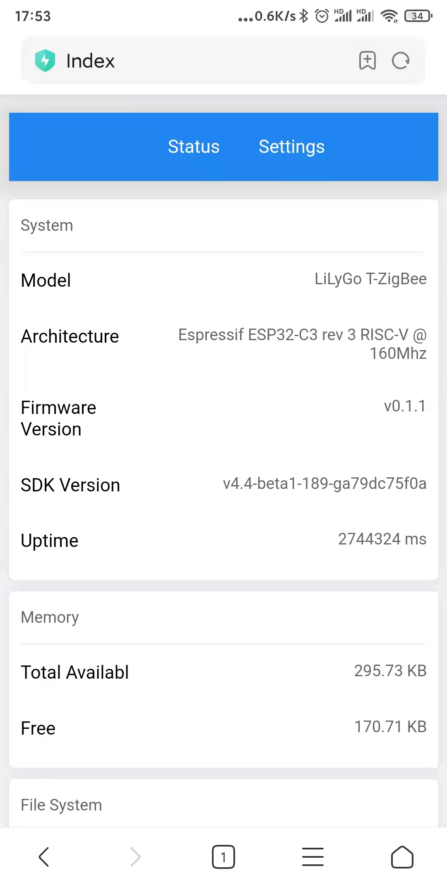
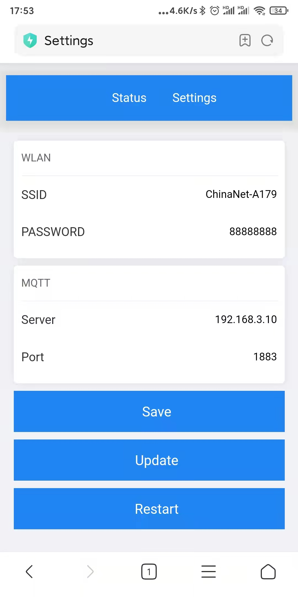

zigbee2mqtt
===========

Configure
----------

- Connect to the hotspot sent by :code:`LilyGo Zigbee2MQTT`, for example :code:`LilyGo-5090`

- Visit :code:`192.168.4.1` in the browser to enter the configuration page

- Configure the WiFi and mqtt server that need to be connected

After the wifi and mqtt server are successfully connected, the blue indicator on :code:`LilyGo Zigbee2MQTT` will be always on.

Button Behavior
----------------

.. csv-table::

    "click",        "Prohibit zigbee sub-devices from joining the gateway"
    "double click", "Allow zigbee sub-devices to join the gateway"

indicator light
---------------

red light
~~~~~~~~~~

.. csv-table::

    "extinguish", "zigbee is off"
    "Bright",     "zigbee is running"

green light
~~~~~~~~~~~~

.. csv-table::

    "extinguish", "Prohibit zigbee sub-devices from joining the gateway"
    "Bright",     "Allow zigbee sub-devices to join the gateway"

blue light
~~~~~~~~~~~

.. csv-table::

    "extinguish", "run error"
    "Bright",     "normal operation"
    "flash",      "Not connected to WiFi"
    "slow flash", "Connected to WiFi, but not connected to mqtt server"
