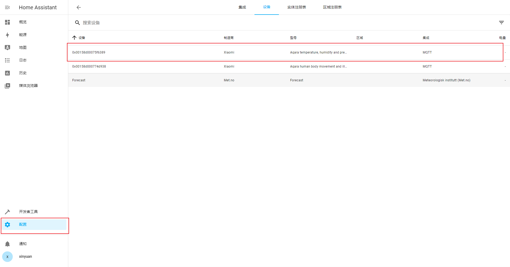
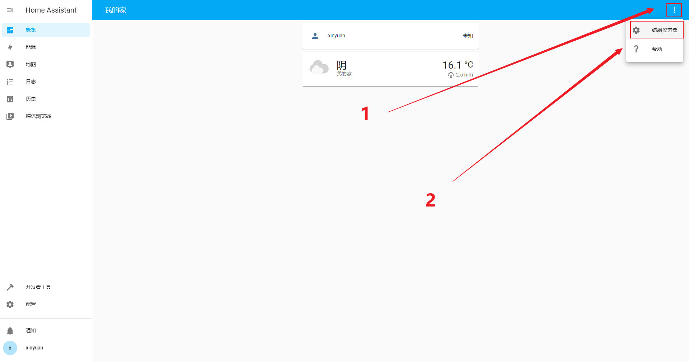
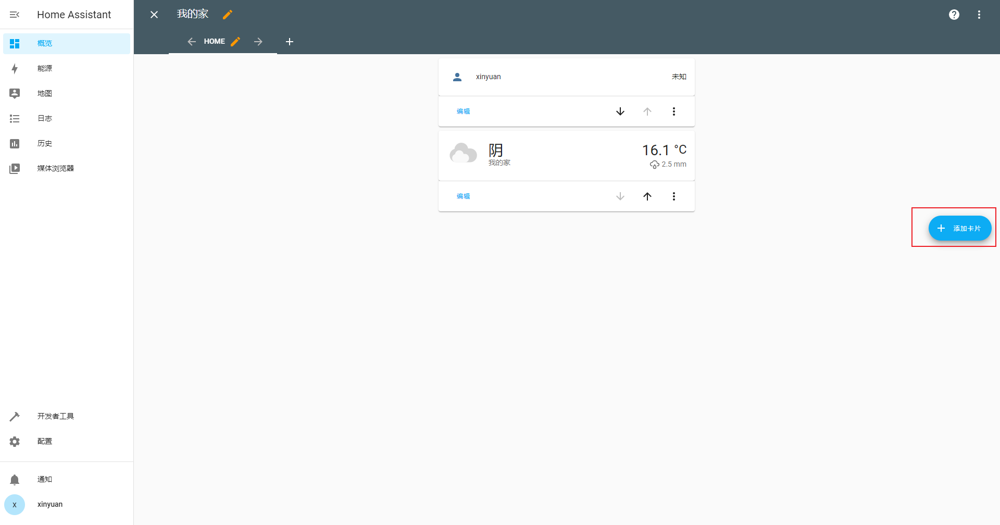
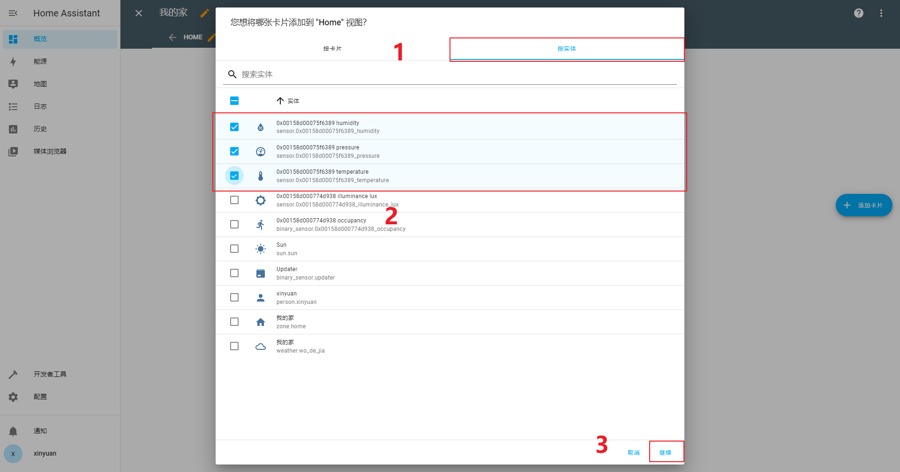
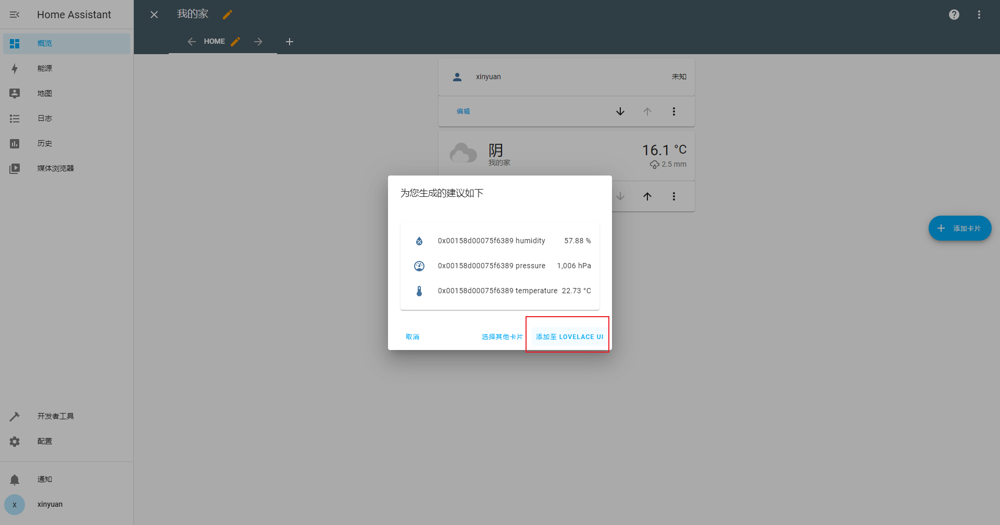
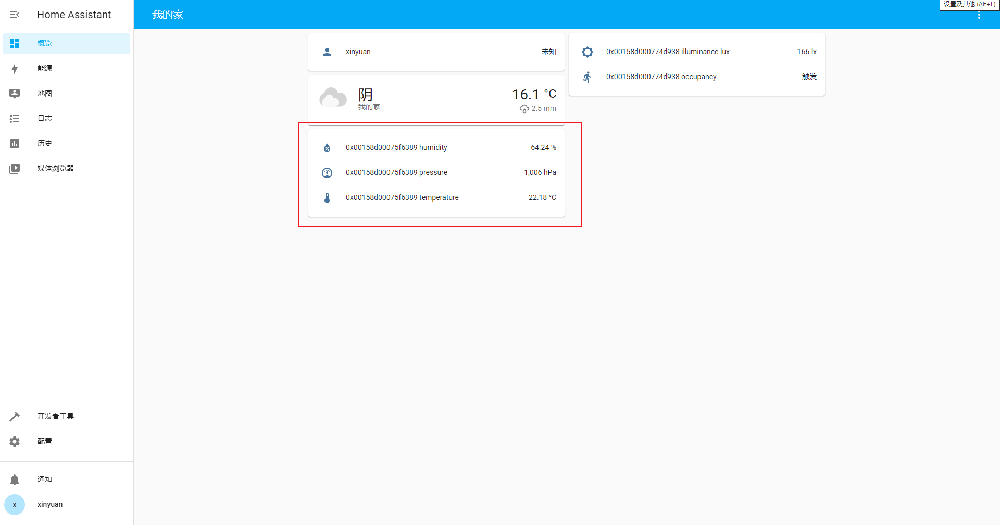

快速开始
========

准备工作
--------

为了使用 Zigbee2MQTT，我们需要以下硬件：

1. LilyGo Zigbee2MQTT

2. 可以运行 MQTT broker 和 Home Assistant 的服务器(例如树莓派)

3. 将与 Zigbee2MQTT 配对的一个或多个 Zigbee 设备。

设置并启动 Zigbee2MQTT
----------------------

参考 :doc:`user-guide/zigbee2mqtt`.

连接设备
--------

为您的设备搜索支持的设备并按照说明进行配对。

一旦您在日志中看到类似于下面的内容，您的设备就已配对，您可以开始使用 MQTT 消息来控制它。

::

    I (276254) Zigbee2MQTT: Successfully interviewed '0x00158d000774d938', device has successfully been paired

Home Assistant
---------------

.. note::

    Home Assistant集成MQTT，请参考 :doc:`user-guide/home-assistant`

Home Assistant集成MQTT之后，设备的信息会上报到Home Assistant

按照以下步骤，添加设备到首页

添加成功，可以实时看到测量数据变化

