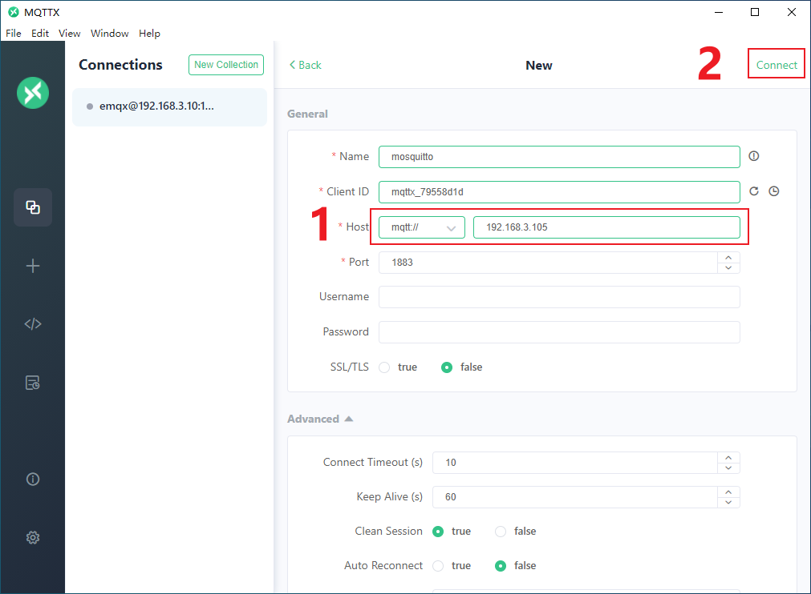
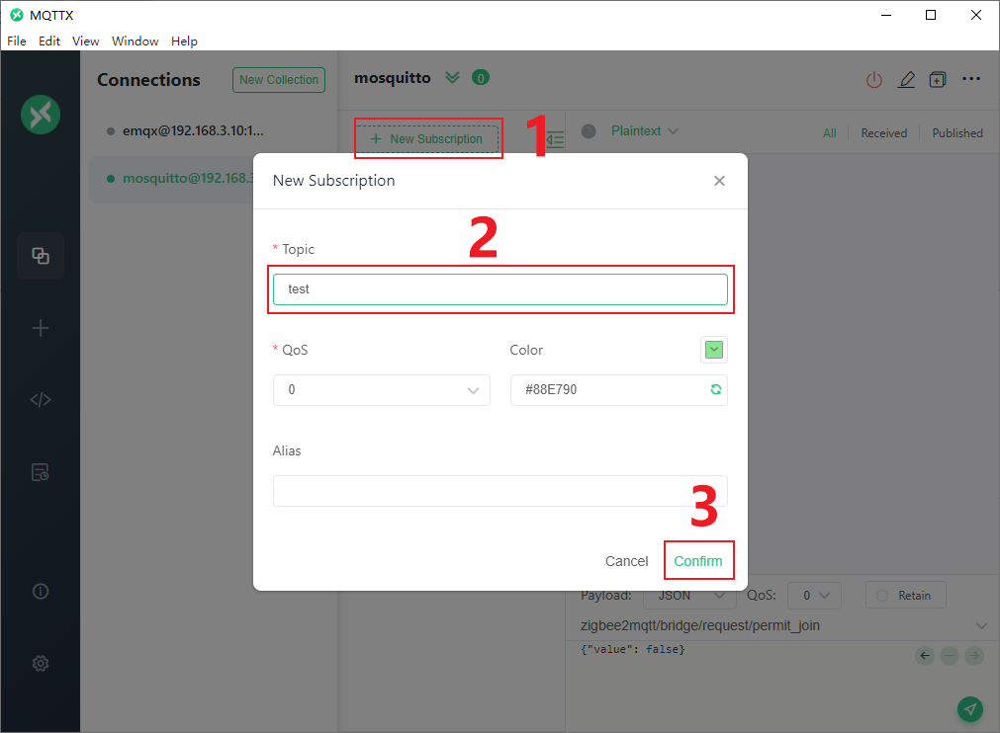
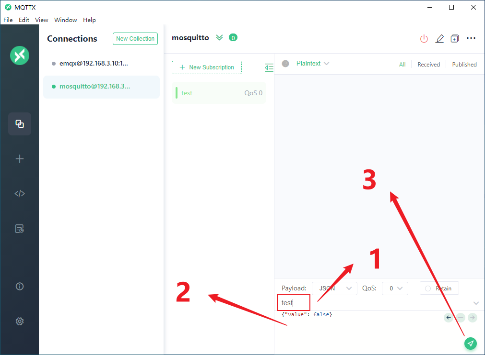
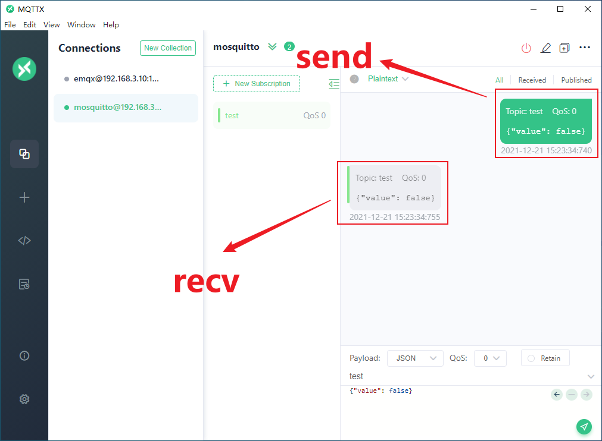

mosquitto
=========

apt安装
-------

.. code-block:: shell

    sudo apt-get update
    sudo apt-get install mosquitto

配置
----

修改 :code:`/etc/mosquitto/mosquitto.conf` 文件，内容如下

.. code-block::

    # Place your local configuration in /etc/mosquitto/conf.d/
    #
    # A full description of the configuration file is at
    # /usr/share/doc/mosquitto/examples/mosquitto.conf.example

    pid_file /run/mosquitto/mosquitto.pid

    persistence true
    persistence_location /var/lib/mosquitto/

    log_dest file /var/log/mosquitto/mosquitto.log

    include_dir /etc/mosquitto/conf.d

    allow_anonymous true

    port 1883

测试
----

..
    docker
    ------

    拉取镜像

    .. code-block:: shell

        docker pull eclipse-mosquitto

    创建工作目录

    .. code-block:: shell

        mkdir -p /mosquitto/config
        mkdir -p /mosquitto/data
        mkdir -p /mosquitto/log

    创建初始化配置文件

    .. code-block:: shell

        vi /mosquitto/config/mosquitto.conf

    在配置文件中添加如下内容，然后保存退出。

    .. code-block:: shell

        persistence true
        persistence_location /mosquitto/data
        log_dest file /mosquitto/log/mosquitto.log

    为目录授权

    .. code-block:: shell

        chmod -R 755 /mosquitto
        chmod -R 777 /mosquitto/log

    启动 mosquitto 容器

    .. code-block:: shell

        docker run -d --name=mosquitto --privileged \
        -p 1883:1883 -p 9001:9001 \
        -v /mosquitto/config/mosquitto.conf:/mosquitto/config/mosquitto.conf \
        -v /mosquitto/data:/mosquitto/data \
        -v /mosquitto/log:/mosquitto/log \
        eclipse-mosquitto
