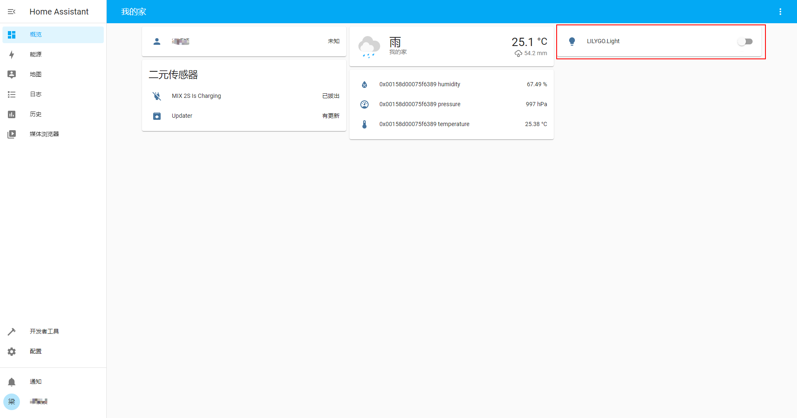

# Light Demo

A zigbee router device. esp32-c3 controls zigbee behavior via zbhci.

## Hardware Required

- T-ZigBee board
- U2T

## Update Firmware

Adjust the DIP switch:

Need to upgrade the firmware of TLSR8258 to [hciDevice_ZR_8258_SDK_eb644f1_MD5_3e7c395bacca28475952808a79ff2ec1.bin](../../firmware/hciDevice_ZR_8258_SDK_eb644f1_MD5_3e7c395bacca28475952808a79ff2ec1.bin)

## Upload Sketch

Adjust the DIP switch:

Upload the light_demo.ino sketch

## Home Assistant

