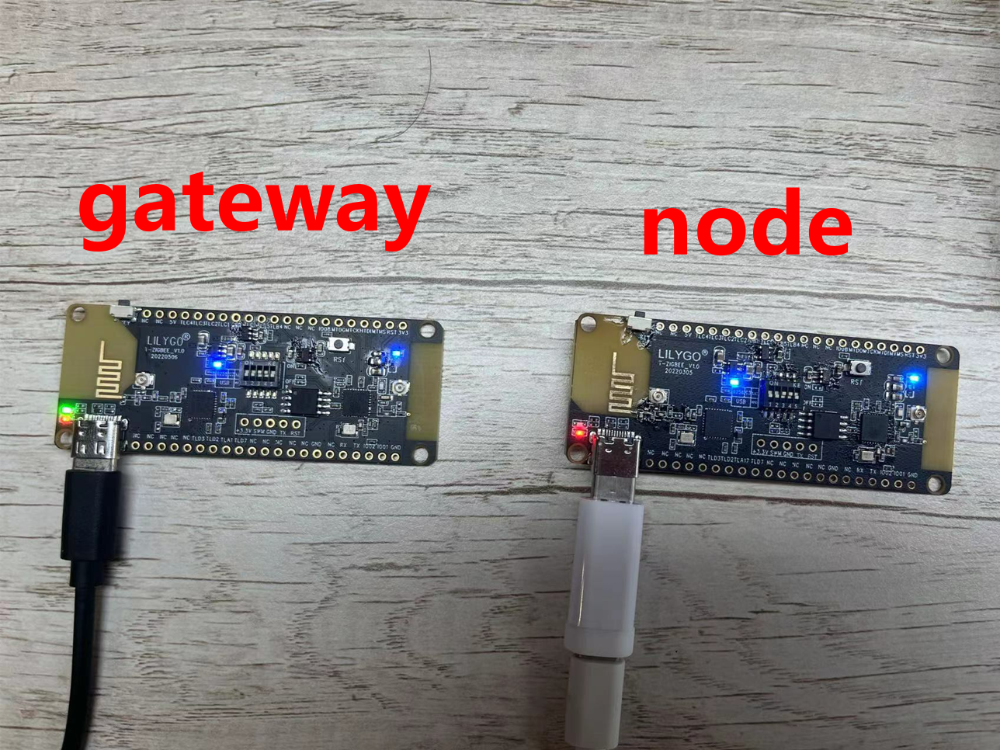
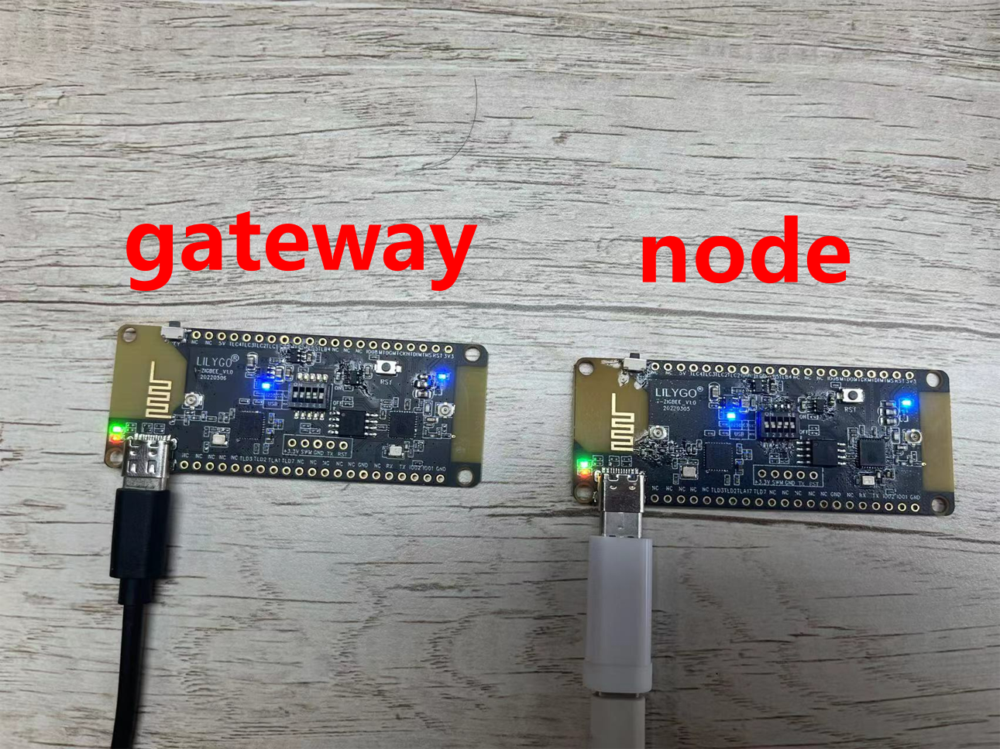
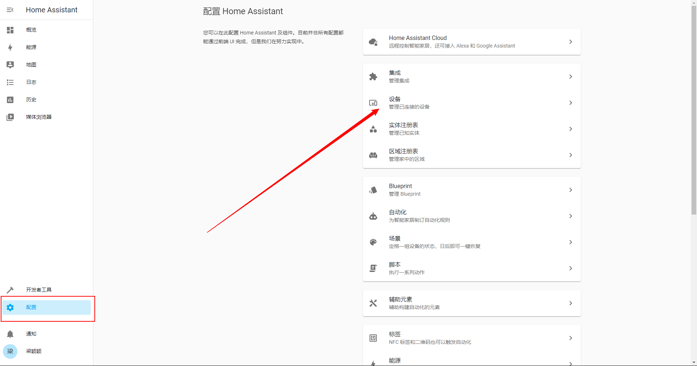
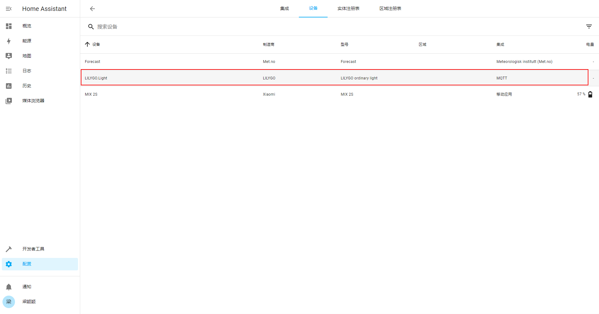
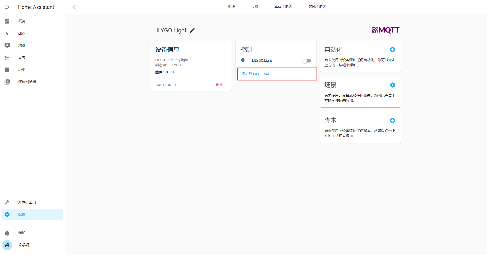

# Light Demo

A zigbee router device. esp32-c3 controls zigbee behavior via zbhci.

## Hardware Required

- T-ZigBee board * 2
- U2T

## Software Required

- Install [mosquitto](https://zbhci.readthedocs.io/en/latest/user-guide/mosquitto.html)
- Install [home assistant](https://zbhci.readthedocs.io/en/latest/user-guide/home-assistant.html)

## zigbee2mqtt

Select one of the T-ZigBee as the zigbee gateway, and program the program [zigbee2mqtt](../zigbee2mqtt). And follow the [documentation](https://zbhci.readthedocs.io/en/latest/user-guide/zigbee2mqtt.html) for related configuration.

## light_demo

Select T-ZigBee as the node. Do the following.

### Update Firmware

Adjust the DIP switch:

Need to upgrade the firmware of TLSR8258 to [hciDevice_ZR_8258_SDK_eb644f1_MD5_3e7c395bacca28475952808a79ff2ec1.bin](../../firmware/hciDevice_ZR_8258_SDK_eb644f1_MD5_3e7c395bacca28475952808a79ff2ec1.bin)

### Upload Sketch

Adjust the DIP switch:

Upload the [light_demo.ino](./light_demo.ino) sketch

## Pair

1. Double-click the button on the upper side of the gateway to open the device join mode. Open successfully. The green led will be constant.

    

2. Press and hold the button on the top of the node device for 3 seconds to start pairing. The green led will be constant, indicating that the pairing is complete.

    

## Home Assistant

